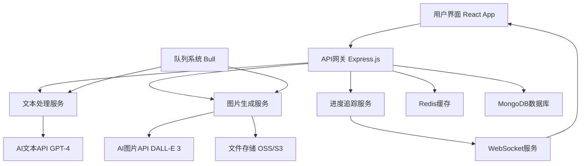
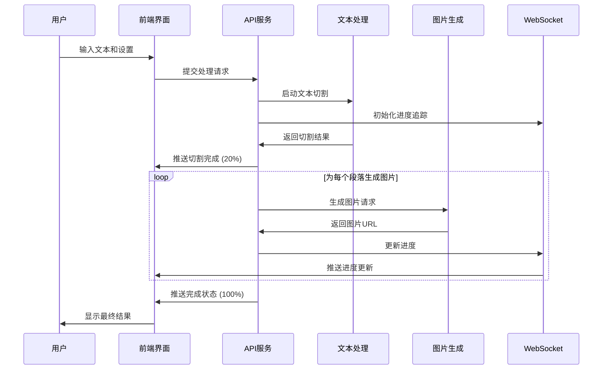

# AI图文生成器 - 产品需求文档 (PRD)

## 📋 版本更新记录

### 🚀 V1.0 - 专业工作台版本 (2024年发布)

#### 产品需求更新
- **核心功能**：AI智能文字切割 + 小红书风格图片批量生成
- **目标用户**：自媒体博主（小红书、微博等平台）
- **设计理念**：专业工作台型多面板体验，提升操作效率
- **关键特性**：实时进度追踪、多模板选择、批量处理

#### ASCII原型图 - 专业工作台型界面

```
┌─────────────────────────────────────────────────────────────────┐
│  📝 AI图文生成器 - 专业版 v1.0                   [保存项目] [导出] │
├─────────────────────────────────────────────────────────────────┤
│ ┌─────────────────────┐ ┌─────────────────────┐ ┌─────────────────┐ │
│ │  📝 文本编辑区       │ │  🎨 模板与设置       │ │  📊 实时预览     │ │
│ │                     │ │                     │ │                 │ │
│ │ ┌─────────────────┐ │ │ 模板库:             │ │ ┌─────────────┐ │ │
│ │ │原始文本:         │ │ │ [简约] [文艺] [商务] │ │ │ 生成进度     │ │ │
│ │ │今天想和大家分享...│ │ │ [清新] [时尚]       │ │ │ ████████░░  │ │ │
│ │ │                 │ │ │                     │ │ │ 80% 完成     │ │ │
│ │ │                 │ │ │ 图片设置:           │ │ └─────────────┘ │ │
│ │ └─────────────────┘ │ │ 尺寸: [3:4▼]        │ │                 │ │
│ │                     │ │ 质量: [高清▼]       │ │ 预览图片:       │ │
│ │ 切割结果:           │ │ 风格: [小红书▼]     │ │ ┌─────┐ ┌─────┐ │ │
│ │ ┌─────────────────┐ │ │                     │ │ │图片1│ │图片2│ │ │
│ │ │段落1 (98字)     │ │ │ ┌─────────────────┐ │ │ │ ✓  │ │ 🔄 │ │ │
│ │ │今天想和大家...   │ │ │ │  🚀 开始生成     │ │ │ └─────┘ └─────┘ │ │
│ │ └─────────────────┘ │ │ └─────────────────┘ │ │ ┌─────┐ ┌─────┐ │ │
│ │ ┌─────────────────┐ │ │                     │ │ │图片3│ │图片4│ │ │
│ │ │段落2 (112字)    │ │ │ 批量操作:           │ │ │ ⏳ │ │ ⏳ │ │ │
│ │ │首先是清洁步骤... │ │ │ [全选] [重新生成]   │ │ └─────┘ └─────┘ │ │
│ │ └─────────────────┘ │ │ [下载] [分享]       │ │                 │ │
│ └─────────────────────┘ └─────────────────────┘ └─────────────────┘ │
│                                                                 │ │
│ 📈 状态栏: 已处理4段文本 | 生成3/4张图片 | 预计剩余时间: 45秒     │ │
└─────────────────────────────────────────────────────────────────┘
```

#### 技术架构要点更新

##### 前端架构
- **框架选择**: React 18 + TypeScript
- **状态管理**: Redux Toolkit (全局状态) + React Query (服务端状态)
- **UI组件库**: Ant Design + 自定义组件
- **布局系统**: CSS Grid + Flexbox (响应式多面板布局)
- **实时通信**: WebSocket (进度推送)

##### 后端架构
- **主框架**: Node.js + Express.js
- **数据库**: MongoDB (文档存储) + Redis (缓存)
- **AI集成**: 
  - 文字切割: OpenAI GPT API
  - 图片生成: DALL-E 3 API / Midjourney API
- **文件存储**: 阿里云OSS / AWS S3
- **队列系统**: Bull Queue (处理异步任务)

##### 核心模块设计
1. **文本处理模块** (`TextProcessor`)
   - 智能切割算法
   - 语义分析
   - 字数统计

2. **图片生成模块** (`ImageGenerator`)
   - AI API调用管理
   - 模板系统
   - 批量处理队列

3. **进度追踪模块** (`ProgressTracker`)
   - 实时进度计算
   - WebSocket推送
   - 状态持久化

4. **文件管理模块** (`FileManager`)
   - 图片上传/下载
   - 批量打包
   - 临时文件清理

---

## 🎯 产品概述

### 核心目标 (Mission)
为自媒体博主提供AI驱动的长文本智能切割与小红书风格图片批量生成工具，让内容创作更高效、更专业。

### 用户画像 (Persona)
**主要用户：** 自媒体博主（小红书、微博等平台）
**核心痛点：**
- 长文本需要手动切割成适合社交媒体的短段落，耗时费力
- 缺乏设计技能，难以制作吸引眼球的图文内容
- 批量制作图片工作量大，影响内容发布频率
- 需要保持视觉风格一致性，提升个人品牌形象

## 🚀 版本规划

### V1.0 专业工作台版本 (当前版本)
**核心价值验证：文字智能切割 + AI图片生成**

#### 功能清单：
- ✅ **多面板工作台界面**
  - 文本编辑区、模板设置区、实时预览区
  - 专业级操作体验，提升工作效率

- ✅ **文本智能处理**
  - AI智能切割（默认按小红书最佳实践）
  - 手动调整功能（删除、合并、重排序段落）
  - 实时字数统计和语义分析

- ✅ **实时进度追踪系统**
  - 分阶段进度显示（文本分析→切割处理→图片生成→完成）
  - 实时进度条和预估时间
  - WebSocket实时推送更新

- ✅ **图片生成与管理**
  - 5个精选小红书风格模板
  - 多种图片尺寸支持（1:1, 3:4, 9:16）
  - 单张重新生成功能
  - 批量下载和选择性下载

- ✅ **专业级操作功能**
  - 项目保存与加载
  - 批量操作（全选、重新生成、下载）
  - 实时预览和状态监控

### V2.0 增强版功能 (规划中)
- 🔐 用户账号系统与云端同步
- 🎨 更多图片模板（15+）和自定义模板
- ⚙️ 高级切割设置和个性化配置
- 📊 使用统计与效果分析
- 🎯 智能推荐和优化建议

### V3.0 企业版功能 (远期规划)
- 📁 批量处理多篇文章
- 👥 团队协作和权限管理
- 🔌 开放API接口
- 📈 深度数据分析
- 🛍️ 模板市场生态

## ⚙️ 关键业务逻辑

### 文本切割规则
1. **默认切割策略**
   - 按小红书最佳实践（每段80-120字）
   - 保持语义完整性，避免在句子中间切割
   - 自动识别段落结构，优先在自然段落处切割

2. **智能优化**
   - AI语义分析，确保每段内容完整
   - 自动调整段落长度，适配不同平台需求
   - 保留关键信息和情感表达

### 图片生成规则
1. **模板应用**
   - 每段文字对应生成一张图片
   - 内置小红书风格提示词模板
   - 自动适配选定的图片尺寸

2. **质量控制**
   - 图片生成失败时自动重试机制
   - 内容审核，确保生成内容合规
   - 风格一致性检查

### 进度计算规则
- **文本分析**: 10%
- **智能切割**: 20%
- **图片生成**: 60%（按段落数平均分配）
- **后处理与优化**: 10%

## 📊 数据契约

### 输入数据结构
```typescript
interface InputData {
  originalText: string;        // 原始文本 (max: 5000字)
  imageSize: '1:1' | '3:4' | '9:16';  // 图片尺寸
  templateId: string;          // 模板ID (template1-5)
  customSettings?: {           // 可选自定义设置
    maxWordsPerSegment: number;
    minWordsPerSegment: number;
    cuttingStrategy: 'smart' | 'byWords' | 'byParagraph';
  };
}
```

### 处理数据结构
```typescript
interface ProcessingData {
  segments: TextSegment[];     // 切割后的文本段落
  progress: number;            // 进度 (0-100)
  currentStage: 'analyzing' | 'cutting' | 'generating' | 'completed';
  estimatedTime: number;       // 预估剩余时间(秒)
  generatedImages: GeneratedImage[];  // 已生成的图片
}

interface TextSegment {
  id: string;
  content: string;
  wordCount: number;
  order: number;
  status: 'pending' | 'processing' | 'completed' | 'failed';
}
```

### 输出数据结构
```typescript
interface OutputData {
  images: GeneratedImage[];    // 生成的图片文件
  segments: TextSegment[];     // 对应的文本内容
  metadata: {
    totalProcessingTime: number;
    successRate: number;
    templateUsed: string;
    createdAt: Date;
  };
}
```

## 🏗️ 技术架构设计

### 系统架构图


### 核心流程图


### 组件交互说明

#### 前端组件架构
```
src/
├── components/
│   ├── TextEditor/          # 文本编辑区组件
│   ├── TemplateSelector/    # 模板选择组件
│   ├── ProgressTracker/     # 进度追踪组件
│   ├── ImagePreview/        # 图片预览组件
│   └── WorkspaceLayout/     # 工作台布局组件
├── services/
│   ├── api.ts              # API调用服务
│   ├── websocket.ts        # WebSocket连接
│   └── fileManager.ts      # 文件管理
├── store/
│   ├── textSlice.ts        # 文本状态管理
│   ├── imageSlice.ts       # 图片状态管理
│   └── progressSlice.ts    # 进度状态管理
└── utils/
    ├── textProcessor.ts    # 文本处理工具
    └── imageUtils.ts       # 图片处理工具
```

#### 后端模块架构
```
server/
├── controllers/
│   ├── textController.js   # 文本处理控制器
│   ├── imageController.js  # 图片生成控制器
│   └── progressController.js # 进度管理控制器
├── services/
│   ├── aiService.js        # AI API集成服务
│   ├── queueService.js     # 队列管理服务
│   └── fileService.js      # 文件存储服务
├── models/
│   ├── Project.js          # 项目数据模型
│   └── ProcessingJob.js    # 处理任务模型
└── middleware/
    ├── auth.js             # 认证中间件
    └── rateLimit.js        # 限流中间件
```

### 技术选型与风险评估

#### 关键技术选型
1. **前端框架**: React 18 + TypeScript
   - **优势**: 成熟生态、强类型支持、组件化开发
   - **风险**: 学习曲线、包体积

2. **状态管理**: Redux Toolkit + React Query
   - **优势**: 可预测状态、缓存优化、开发工具
   - **风险**: 复杂度增加、样板代码

3. **AI服务集成**: OpenAI API
   - **优势**: 先进的AI能力、稳定的API
   - **风险**: 成本控制、API限制、网络依赖

4. **实时通信**: WebSocket
   - **优势**: 低延迟、双向通信
   - **风险**: 连接稳定性、扩展性挑战

#### 潜在技术风险与应对策略

1. **AI API调用风险**
   - **风险**: API限制、成本过高、响应延迟
   - **应对**: 实现请求队列、缓存机制、降级策略

2. **大文件处理风险**
   - **风险**: 内存占用、处理超时
   - **应对**: 流式处理、分片上传、进度保存

3. **并发处理风险**
   - **风险**: 系统负载、资源竞争
   - **应对**: 队列系统、限流机制、负载均衡

4. **数据安全风险**
   - **风险**: 用户数据泄露、API密钥暴露
   - **应对**: 数据加密、权限控制、安全审计

## 📈 成功指标

### 技术指标
- **响应时间**: 文本切割 < 3秒，图片生成 < 30秒/张
- **成功率**: 文本处理成功率 > 99%，图片生成成功率 > 95%
- **并发能力**: 支持100+并发用户
- **可用性**: 系统可用性 > 99.5%

### 业务指标
- **用户满意度**: 用户评分 > 4.5/5.0
- **功能使用率**: 核心功能使用率 > 80%
- **处理效率**: 相比手动操作提升效率 > 10倍
- **错误率**: 用户操作错误率 < 5%

---

*文档版本: v1.0*  
*最后更新: 2024年*  
*负责人: 产品设计团队*